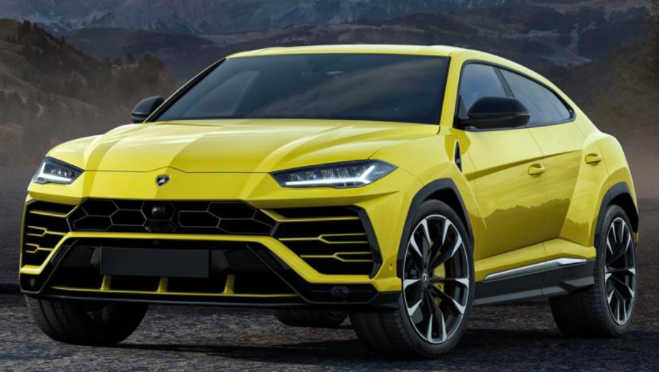
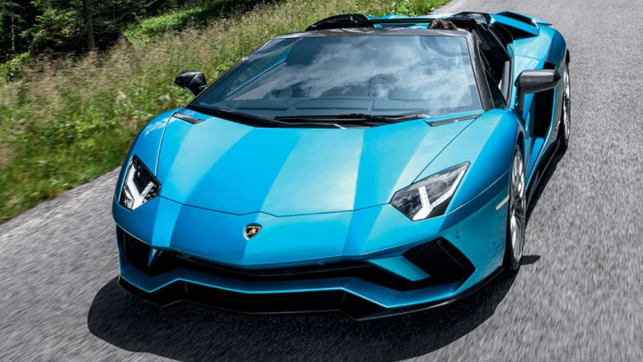

# CSS基础

CSS (Cascading Style Sheets) 用于渲染HTML元素标签的样式.

CSS 是在 HTML 4 开始使用的,是为了更好的渲染HTML元素而引入的.

CSS 可以通过以下方式添加到HTML中:

- 内联样式 在HTML元素中使用"style" 属性
- 文档样式表 在HTML文档头部 `<head> `区域使用`<style>` 元素 来包含CSS
- 外部引用  使用外部 `CSS` 文件


最好的方式是通过外部引用CSS文件.


### 内联样式

当特殊的样式需要应用到个别元素时，就可以使用内联样式。 使用内联样式的方法是在相关的标签中使用样式属性。样式属性可以包含任何 CSS 属性

```
<div style="color:blue;background-color:red;font-size:30px;">我是div</div>
```

### 文档样式表

⽂文档样式表(document style sheet)、内嵌样式表(embed style sheet)

将样式写在head元素的style元素中


```
<!DOCTYPE html>
<html lang="en">
<head>
    <meta charset="UTF-8">
    <meta name="viewport" content="width=device-width, initial-scale=1.0">
    <meta http-equiv="X-UA-Compatible" content="ie=edge">
    <title>Document</title>
    <style>
        div {
            /* 文字颜色 */
            color: green;
            /* 设置背景色 */
            background-color: red;
            /* 文字大小 */
            font-size: 30px;
        }
    </style>
</head>
<body>
<div>我是div</div>
</body>
</html>

```


### 外部样式表

将样式写在单独的CSS⽂文件中，然后在当前⽹网⻚页的head元素中⽤用link元素引⽤用

在CSS⽂文件中使⽤用@charset指定⽂文件编码，一般都是UTF-8

page.css

```
@charset "UTF-8";

div {
    color: blue;
    background-color: red;
    font-size: 30px;
}
```


```
<!DOCTYPE html>
<html lang="en">
<head>
    <meta charset="UTF-8">
    <meta name="viewport" content="width=device-width, initial-scale=1.0">
    <meta http-equiv="X-UA-Compatible" content="ie=edge">
    <title>Document</title>
    <link rel="stylesheet" href="css/page.css">
</head>
<body>
<div>我是div</div>
</body>
</html>
```


**@import**


可以在style元素或者CSS⽂文件中使⽤用@import导⼊入其他的CSS⽂文件

不不建议使⽤用@import导⼊入CSS⽂文件，它的效率⽐比link元素低
 


### 注释


CSS的注释和HTML的注释是不不⼀一样的:`/* 注释内容 */(不不能嵌套)`


### HTML和CSS的编写准则

在编写HTML和CSS代码过程中，要遵守⼀一个准则

- 结构、样式分离,因此，不不要使⽤用HTML元素的属性来给元素添加样式，⽐比如body的bgcolor、img的width\height等


### 设置网页图标


link元素除了了可以⽤用来引⼊入CSS⽂文件，还可以设置⽹网⻚页的图标(href的值是图标链接)
- link元素的rel属性不不能省略略，⽤用来指定⽂文档与链接资源的关系
- 一般rel若确定，相应的type也会默认确定，所以可以省略略type
- ⽹网⻚页图标⽀支持的图⽚片格式是icon、png，常⽤用⼤大⼩小是16x16、24x24、32x32(单位:像素)


```
<link rel="icon" href="http://www.jd.com/favicon.ico">
```


### 常⽤用CSS属性


按照CSS属性的具体⽤用途，⼤大致可以分类为


- ⽂文本:color、direction、letter-spacing、word-spacing、line-height、text-align、text-indent、text-transform、text-decoration、white-space

- 字体:font、font-family、font-style、font-size、font-variant、font-weight

- 背景:background、background-color、background-image、background-repeat、background-attachment、
background-position

- 盒⼦子模型:width、height、border、margin、padding

- 列列表:list-style

- 表格:border-collapse

- 显示:display、visibility、overflow、opacity、filter

- 定位: vertical-align、position、left、top、right、bottom、float、clear


### span元素 & div元素

- span元素
	- 默认情况下，跟普通⽂文本⼏几乎没差别
	- ⽤用于区分特殊⽂文本和普通⽂文本，⽐比如⽤用来显示⼀一些关键字
 - div元素
 	- 一般作为其他元素的⽗父容器器，把其他元素包住，代表⼀一个整体
	- ⽤用于把⽹网⻚页分割为多个独⽴立的部分


```
<!DOCTYPE html>
<html lang="zh">
<head>
    <meta charset="UTF-8">
    <title>11-div-span练习</title>
    <style>
        div {
            width: 250px;
            /* 让元素向左浮动 */
            float: left;
            /* 外边距：元素与元素之间的间距 */
            margin: 10px;
        }

        img {
            width: 250px;
        }

        span {
            background-color: black;
            color: orange;
        }

        h2 {
            font-size: 20px;
        }
    </style>
</head>
<body>

<h1>兰博基尼车型预览</h1>

<!-- urus -->
<div>
    <h2>Urus</h2>
    <a href="https://www.lamborghini.com/cn-en/%E8%BD%A6%E5%9E%8B/urus" target="_blank">
        
    </a>
    <p><span>Urus</span>，全球首辆超级SUV（运动型多用途车）。传承着极具辨识度的兰博基尼DNA，同时Urus也是一款突破性的车型：令人惊讶的车身尺寸、纯正兰博基尼式设计和出色的性能都是其脱颖而出的原因。Urus的动态流线性独特轮廓尽显其超级跑车的传统，卓越的比例安排又传达着力量、稳固性和安全感</p>
</div>

<!-- Aventador S Roadster -->
<div>
    <h2>Aventador S Roadster</h2>
    <a href="https://www.lamborghini.com/cn-en/%E8%BD%A6%E5%9E%8B/aventador/aventador-s-roadster" target="_blank">
        
    </a>
    <p><span>Aventador S Roadster</span>，这款标志性的跑车以其最具吸引力的形式再次超越了自我。高达<strong>740马力</strong>的全新<strong>V12引擎</strong>以及敞篷款式所展现的兰博基尼独特设计，在Aventador S Roadster (敞篷版)体现得淋漓尽致。采用最尖端的技术，带来前所未有的驾驭体验，让追求迅猛、激情驾驭感受的汽车爱好者满足内心深处的渴求。</p>
</div>

</body>
</html>
```


